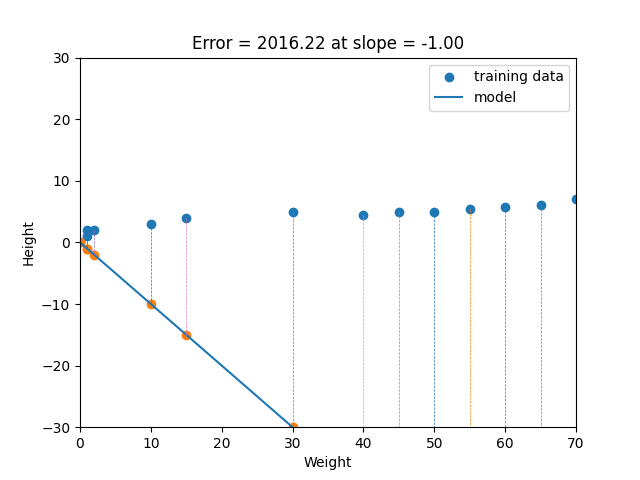
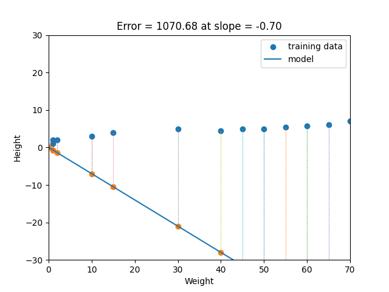
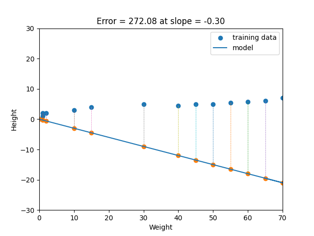
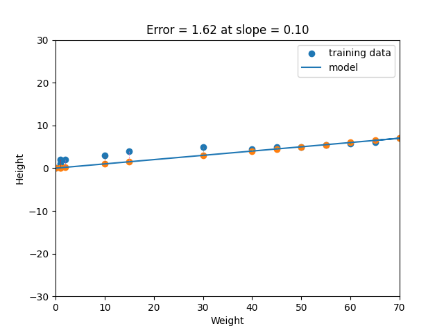
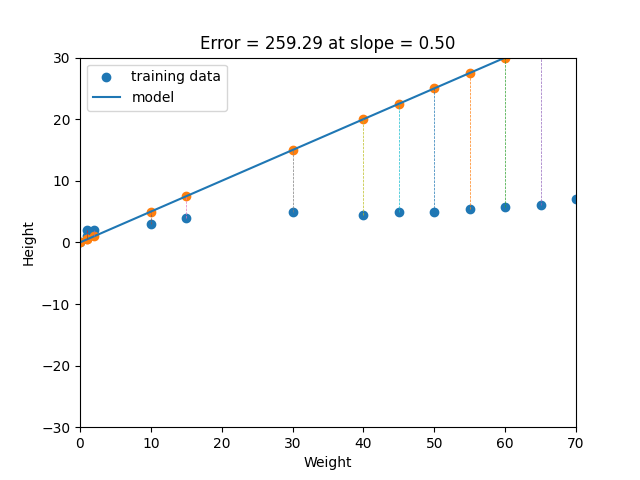
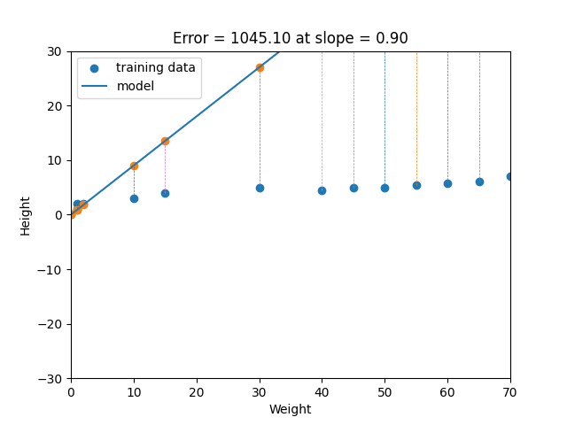
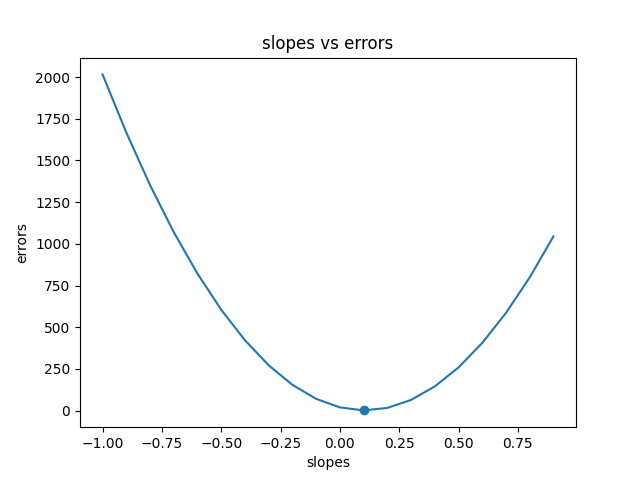

# Regression
Simple Regression in Python. For detail implementation see regression.py file.

Linear regression is a statistical method that tries to show a relationship between variables. It looks at different data points and plots a trend line. Linear regression attempts to model the relationship between two variables by fitting a linear equation to observed data. One variable is considered to be an explanatory variable, and the other is considered to be a dependent variable. For example, a modeler might want to relate the weights of individuals to their heights using a linear regression model. Simply stated, the goal of linear regression is to fit a line to a set of points. When the target variable that we’re trying to predict is continuous, we call the learning problem a regression problem. Let’s suppose we want to model the above set of points with a line. To do this we’ll use the standard y = mx + b line equation where m is the line’s slope and b is the line’s y-intercept. To find the best line for our data, we need to find the best set of slope m and y-intercept b values.

Code:

import pandas as pd
import numpy as np
import matplotlib.pyplot as plt

#weight_train = [0,1,1,10,15,30,35,40,45,50,60,70]
#height_train = [0,.8,.9,1,1.5,3,3,2,5,5,6,5.5]

data = [[0,0],[1,1],[1,2],[2,2],[10,3],[15,4],[30,5],[40,4.4],[45,5],[50,5],[55,5.5],[60,5.7],[70,7],[65,6]]
weight_train = [data[x][0] for x in range(len(data))]
height_train = [data[x][1] for x in range(len(data))]

print("fdfd")
print("fdfd")
print("fdfd")

m = 2
c =0
errors = []
slopes = [x*0.1 for x in range(-10,10)]

for m in slopes:
    height_model = [(m * x) + c for x in weight_train]

    error = sum([(i - j) ** 2 for i, j in zip(height_train, height_model)]) / len(height_train)
    errors.append(error)

    #   plt.figure()
    plt.scatter(weight_train, height_train, label='training data')
    plt.xlabel("Weight")
    plt.ylabel("Height")
    plt.scatter(weight_train, height_model)
    plt.plot(weight_train, height_model, label='model')
    plt.title('Error = %.2f at slope = %.2f' % (error, m))

    plt.axis([0, 70, -30, 30])

    plt.plot([weight_train, weight_train],[height_train, height_model],'--', linewidth=.5)
    plt.legend()
    plt.show()

print("Errors: ",errors)
print("Minimum Error: ",min(errors))

print("index of minimum error: ",errors.index(min(errors)))

slope = slopes[errors.index(min(errors))]
print("Slope for minimum error: ",slope)

plt.scatter(slope,min(errors))

plt.plot(slopes,errors)
plt.title("slopes vs errors")
plt.xlabel('slopes')
plt.ylabel('errors')

plt.show()
