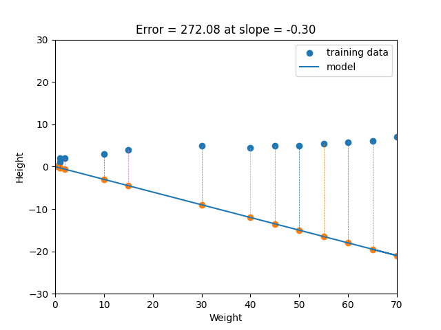

# Regression
Simple Regression in Python. For detail implementation see regression.py file.

In regression, we normally have one dependent variable and one or more independent variables. Here we try to “regress” the value of the dependent variable “Y” with the help of the independent variables. In other words, we are trying to understand, how the value of ‘Y’ changes w.r.t change in ‘X’.

For the regression analysis is be a successful method, we understand the following terms:
1. Dependent Variable: This is the variable that we are trying to understand or forecast.
1. Independent Variable: These are factors that influence the analysis or target variable and provide us with information regarding the relationship of the variables with the target variable.

